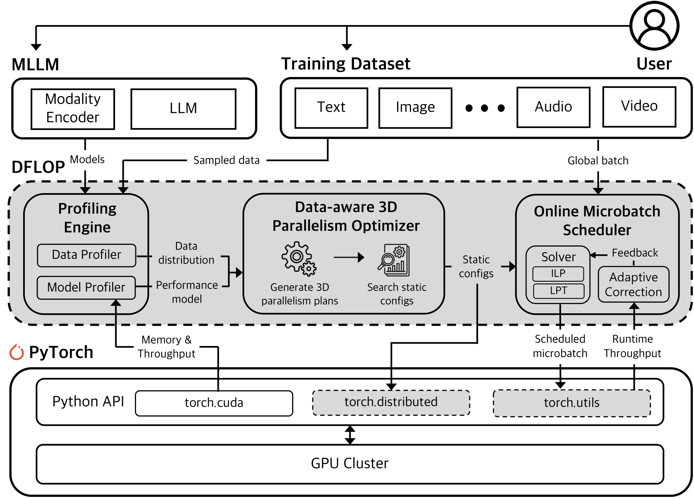

# DFLOP: A Data-driven Framework for Multimodal LLM Training Pipeline Optimization

DFLOP is a **data-driven optimization framework** designed to improve distributed training efficiency for **Multimodal Large Language Models (MLLMs)**.  
Unlike existing data-agnostic frameworks that parallelize computation blindly, DFLOP adapts parallelism and scheduling to the **real data characteristics**, mitigating computation imbalance and input-dependent performance variance.

---

## 🔍 Overview

DFLOP consists of three core components:

1. **Profiling Engine**  
   - Profiles both model and data workloads.  
   - Builds predictive models for memory and throughput across input shapes.  
   - Analyzes the empirical input-shape distribution from real datasets.

2. **Data-aware 3D Parallelism Optimizer**  
   - Uses profiling results to determine optimal 3D parallelism configurations  
     (Tensor / Pipeline / Data Parallelism) for each module independently.  
   - Minimizes expected makespan under memory and hardware constraints.

3. **Online Microbatch Scheduler**  
   - Dynamically partitions each training batch using **Integer Linear Programming (ILP)**.  
   - Balances computation load across pipeline stages in real time.  
   - Reduces GPU idle time caused by pipeline bubbles.

---

## 🧠 System Architecture

Below is a high-level architecture diagram (from `ddml_overview2.pdf`) showing the integration of DFLOP with a PyTorch-based training pipeline:

  

**Workflow Summary**

1. **Model Profiler** builds performance models for memory and throughput.  
2. **Data Profiler** samples dataset input shapes and builds input distribution statistics.  
3. **3D Parallelism Optimizer** searches for the optimal configuration per module.  
4. **Online Microbatch Scheduler** runs asynchronously during training to dynamically schedule microbatches.

---

## ⚙️ Key Features

| Component | Description | Techniques |
|------------|--------------|-------------|
| **Profiling Engine** | Builds predictive models from synthetic + real data | Linear interpolation over input shape space |
| **3D Parallelism Optimizer** | Searches optimal tensor/pipeline/data parallel configuration | Expected makespan minimization |
| **Online Microbatch Scheduler** | Balances runtime load via ILP optimization | Real-time dynamic scheduling |
| **Inter-model Communicator** | Efficient communication between asymmetric DP groups | Gather/scatter across process groups |

---

## 📊 Experimental Highlights

- Achieves **up to 3.6× faster training throughput** than PyTorch and Megatron-LM  
  while maintaining model accuracy.  
- Reduces **pipeline idle time by up to 84%**.  

---
